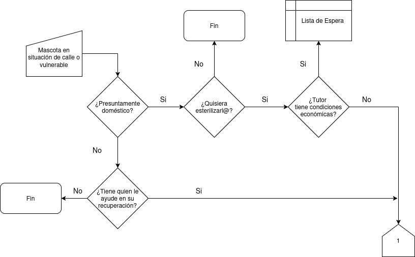
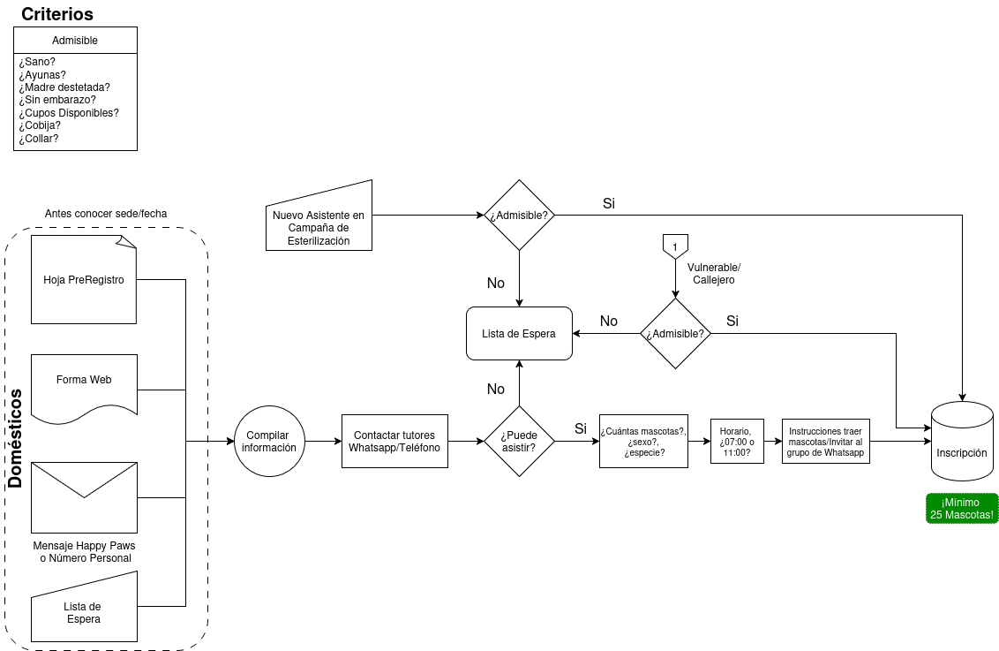
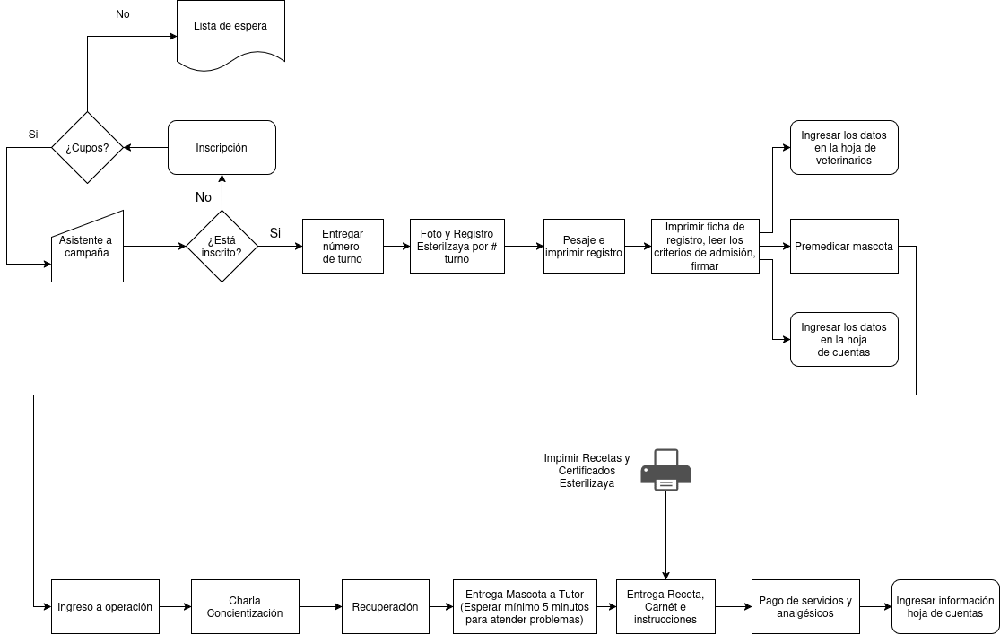

# Proceso de Gestión de las Esterilizaciones

## Admisión Vulnerable

Ante la falta de un catastro de mascotas, no es posible distinguir entre una mascota callejera de una doméstica que pasa en la calle, para evitar inconvenientes puedes seguir este diagrama de flujo para decidir si la quieres esterilizar

## Inscripción

Como en cualquier proceso quirúrgico, los tutores se deben _inscribir_ con el fin que entiendan las condiciones de admisabilidad e indiquen a que hora pueden venir. Además, esto te asegura que tengas los cupos mínimos para hacer un evento y no sobrepasarte del máximo de tus capacidades. Puedes considerar el siguiente diagrama de flujo para manejar tus incripciones

## Registro

Una vez completado el mínimo de mascotas, entrega los turnos de acuerdo al orden de llegada y luego registrarlos con Esterilizaya, cuando tengas 2 turnos completados imprime las recetas y cuando tengas 8 las fichas. Acá puedes ver en más detalle nuestro proceso de registro

